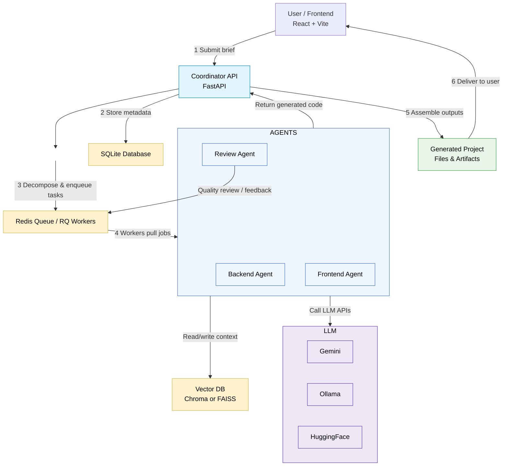

# MultiAgent AI Project Builder

This project implements an **AI Agent System** that converts a short, high-level project brief into a set of concrete technical tasks, then uses specialized sub-agents to generate code for each component.

## 🎥 Demo Video

[](https://youtu.be/4Kp4FD7a26A)


## 🧠 Architecture Overview

- **Coordinator Agent:**  
  Receives the project brief, decomposes it into backend and frontend tasks, dispatches to specialized sub-agents, and reviews outputs.

- **Backend Agent (Python / FastAPI):**  
  Creates APIs, database models, and business logic workflows.

- **Frontend Agent (React + TypeScript):**  
  Generates responsive UI components using Tailwind CSS and Vite.

## ⚙️ Tech Stack

| Layer        | Technology                                                             |
| ------------ | ---------------------------------------------------------------------- |
| Backend      | FastAPI (Python), SQLite / ChromaDB, RQ Worker                         |
| Frontend     | React + Vite + TypeScript + Tailwind CSS                               |
| LLM          | Gemini API (default), Ollama (local fallback), Hugging Face (optional) |
| Vector Store | Chroma (default) / FAISS (fallback)                                    |
| Job Queue    | Redis + RQ (or APScheduler fallback)                                   |


---
### 🗂️ Folder Structure Overview
```
multiagent-ai-project-builder/
│
├── .gitignore
├── README.md
├── requirements.txt
├── .env.example               ← Example environment variables
│
├── backend/                   ← Core backend logic (FastAPI + AI orchestration)
│   ├── main.py                ← FastAPI app entrypoint
│   ├── requirements.txt
│   ├── app/
│   │   ├── api/
│   │   │   └── brief.py       ← API endpoints for project brief submission & ZIP download
│   │   ├── models/
│   │   │   └── project.py     ← SQLAlchemy / Pydantic models (Project & Tasks)
│   │   ├── services/
│   │   │   ├── coordinator.py ← Coordinates the multi-agent flow
│   │   │   ├── llm_adapter.py ← Interface for LLM APIs (Gemini, Ollama, HuggingFace, etc.)
│   │   │   ├── task_builder.py← Decomposes briefs & builds directory/file structure
│   │   │   └── utils.py       ← Helper utilities
│   │   └── db/
│   │       └── database.py    ← SQLAlchemy database configuration
│   │
│   ├── generated_projects/    ← AI-generated project outputs (auto-created folders)
│   │   └── build-a-task-management-app/
│   │       ├── backend/
│   │       ├── frontend/
│   │       └── README.md
│   │
│   └── tests/                 ← Unit tests for API
│       └── test_api.py
│
├── frontend/                  ← React + Vite frontend for user input and results
│   ├── src/
│   │   ├── App.tsx            ← UI for entering briefs and downloading results
│   │   ├── api/client.ts      ← Axios client to call FastAPI backend
│   │   ├── components/        ← UI Components (form, task list, download)
│   │   └── styles/main.css
│   └── public/favicon.ico
│
└── docker-compose.yml         ← Optional: container setup for backend + frontend
```

## 🧠 System Workflow — Mermaid Diagram


**Core idea (brief):**  
A single *Coordinator* (FastAPI) receives a brief from the frontend, decomposes it into tasks, enqueues work, and oversees specialized sub-agents (backend-, frontend-, and review-agents). Agents run as asynchronous workers, call LLM providers to generate code and content, store embeddings in a vector DB, and return artifacts for assembly. :contentReference[oaicite:1]{index=1}

---

## How the workflow flows (step-by-step)

1. **User submits a brief (Frontend UI).**  
   The React/Vite frontend collects the brief and submits it to the backend Coordinator via HTTP. :contentReference[oaicite:2]{index=2}

2. **Coordinator receives & persists the brief.**  
   The Coordinator endpoint validates and persists metadata (e.g., to SQLite). It then enqueues one or more async jobs representing decomposed tasks. :contentReference[oaicite:3]{index=3}

3. **Task decomposition.**  
   The Coordinator either directly runs a decomposition step or enqueues a decomposition job. This step splits the high-level brief into concrete tasks (e.g., “create auth API”, “create login UI component”, “add DB model for X”).

4. **Jobs queued (Redis + RQ).**  
   Each task is enqueued to Redis (RQ worker queue). Worker processes (agent workers) pull jobs from Redis and begin execution. The project README lists Redis + RQ as the job queue / worker approach. :contentReference[oaicite:4]{index=4}

5. **Agent execution (workers).**  
   Each agent (Backend Agent / Frontend Agent / Review Agent / etc.):
   - Receives the job payload (task spec + context).
   - Calls an LLM provider (Gemini by default; Ollama or Hugging Face as fallback/options) to generate code or spec text.
   - Optionally generates embeddings from LLM outputs and persists/retrieves them in/from the vector DB (Chroma default / FAISS fallback).
   - Returns generated artifacts (code snippets, file trees, tests) to the Coordinator (via job result, DB, or direct file output).

6. **Review & iteration.**  
   The Coordinator (or a Review Agent) inspects generated outputs, runs quick validations or unit-test generation, and — if necessary — enqueues refinement jobs.

7. **Assemble final project.**  
   Once tasks are approved, the Coordinator assembles the files into a project scaffold (folder structure / repo) and exposes them for download or preview. For local development you can run the backend and frontend as described in the quickstart. :contentReference[oaicite:5]{index=5}

---

## Agents & responsibilities (concise)
- **Coordinator Agent (FastAPI)**  
  - Receives briefs and user requests.  
  - Decomposes briefs to tasks.  
  - Enqueues jobs and orchestrates end-to-end flow. :contentReference[oaicite:6]{index=6}

- **Backend Agent**  
  - Generates APIs, DB models, and server-side wiring (FastAPI + Python).  
  - Validates generated code and writes to artifact storage.

- **Frontend Agent**  
  - Generates UI components (React + TypeScript + Tailwind + Vite).  
  - Produces responsive UI code and scaffolding.

- **Review / Quality Agent**  
  - Reviews agent outputs for style/consistency; may add unit tests or linting suggestions.

- **Vector/Embedding Agent (logic)**  
  - Converts candidate docs/snippets to embeddings and stores/retrieves them from Chroma/FAISS to surface context or prior knowledge.

- **Worker Pool (RQ workers)**  
  - Runs agent code asynchronously; monitors and reports job statuses to the Coordinator (via Redis/RQ).

---

## Communication channels (how components talk)

- **Frontend ↔ Backend:** HTTP(S) requests (REST endpoints).  
- **Coordinator ↔ Workers:** Redis job queue (RQ). Coordinator enqueues jobs; workers pull and push results. :contentReference[oaicite:7]{index=7}  
- **Agents ↔ LLM Providers:** HTTPS API calls to Gemini / Ollama / Hugging Face. :contentReference[oaicite:8]{index=8}  
- **Agents ↔ Vector DB:** gRPC/HTTP or SDK calls to Chroma (or FAISS locally) to store/retrieve embeddings. :contentReference[oaicite:9]{index=9}  
- **Coordinator ↔ DB:** SQLite (or configured DB) for metadata, job tracking, and artifact indexes. :contentReference[oaicite:10]{index=10}

> Note: Real-time progress reporting to the frontend (SSE / WebSockets) is a common enhancement pattern but not necessarily implemented by default. If you want live progress, add a websocket/SSE endpoint and emit job status messages from the worker callbacks.

---
### 🚀 Quickstart (Local Setup)
```
# 1. Clone the repository
git clone https://github.com/<your-username>/multiagent-ai-project-builder.git
cd multiagent-ai-project-builder

# 2. Set up backend
cd backend
python -m venv venv
source venv/bin/activate   # (or venv\Scripts\activate on Windows)
pip install -r requirements.txt
cp .env.example .env       # configure your API keys (Gemini, Ollama, etc.)
uvicorn app.main:app --reload

# 3. Set up frontend
cd ../frontend
npm install
npm run dev
```
Frontend runs at:``` http://localhost:5173```
Backend API runs at:``` http://localhost:8000```
Make sure Redis is running before starting RQ workers:
```
redis-server
rq worker
```
### 🧩 Environment Variables
All configuration values are stored in .env (copy from .env.example).
| Variable          | Description                                                         | Example                    |
| ----------------- | ------------------------------------------------------------------- | -------------------------- |
| `LLM_PROVIDER`    | Choose which LLM backend to use (`gemini`, `ollama`, `huggingface`) | `gemini`                   |
| `GEMINI_API_KEY`  | Google Gemini API Key                                               | `your-gemini-key`          |
| `OLLAMA_BASE_URL` | Local Ollama endpoint (if using local models)                       | `http://localhost:11434`   |
| `CHROMA_PATH`     | Directory for vector database                                       | `./chroma_db`              |
| `DATABASE_URL`    | SQLite/SQLAlchemy database URI                                      | `sqlite:///./project.db`   |
| `REDIS_URL`       | Redis connection string                                             | `redis://localhost:6379/0` |

### 🧠 Agent Execution Logic (Internal Overview)

| Agent                 | Purpose                             | Core Functions           | Output                |
| --------------------- | ----------------------------------- | ------------------------ | --------------------- |
| **Coordinator Agent** | Oversees everything                 | `coordinator.py`         | Orchestrated job flow |
| **Backend Agent**     | Generates FastAPI, DB, logic        | `task_builder.py` + LLM  | Backend source files  |
| **Frontend Agent**    | Generates React components          | `task_builder.py` + LLM  | Frontend source files |
| **Review Agent**      | Validates code, provides feedback   | `review_agent` (planned) | Refined artifacts     |
| **LLM Adapter**       | Interfaces with LLM APIs            | `llm_adapter.py`         | Model responses       |
| **VectorDB Manager**  | Manages embeddings & search context | `database.py`            | Context persistence   |

**Agents typically:**
Fetch task payload from Redis.

Query LLM via adapter.

Generate code or documentation.

Save outputs in /generated_projects/.

Report success/failure to Coordinator.

### 🧰 API Endpoints (FastAPI)
| Endpoint                   | Method | Description                                                |
| -------------------------- | ------ | ---------------------------------------------------------- |
| `/api/brief/submit`        | `POST` | Accepts a user project brief and starts task decomposition |
| `/api/brief/status/{id}`   | `GET`  | Checks the progress or status of a project build           |
| `/api/brief/download/{id}` | `GET`  | Returns a ZIP of the generated project files               |
| `/api/health`              | `GET`  | Basic health/status check of backend                       |

You can explore all endpoints via Swagger UI at
👉 `http://localhost:8000/docs`
### 🧪 Testing
To run unit tests for backend components:
```
cd backend
pytest -v
```
Tests are located in /backend/tests/, including:

API endpoint validation (test_api.py)

Model and DB schema checks

Task flow and LLM adapter tests (extendable)

