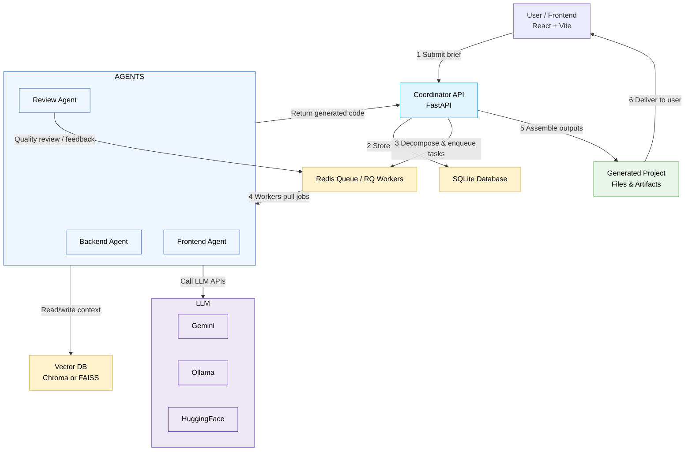

# MultiAgent AI Project Builder

This project implements an **AI Agent System** that converts a short, high-level project brief into a set of concrete technical tasks, then uses specialized sub-agents to generate code for each component.

## 🧠 Architecture Overview

- **Coordinator Agent:**  
  Receives the project brief, decomposes it into backend and frontend tasks, dispatches to specialized sub-agents, and reviews outputs.

- **Backend Agent (Python / FastAPI):**  
  Creates APIs, database models, and business logic workflows.

- **Frontend Agent (React + TypeScript):**  
  Generates responsive UI components using Tailwind CSS and Vite.

## ⚙️ Tech Stack

| Layer        | Technology                                                             |
| ------------ | ---------------------------------------------------------------------- |
| Backend      | FastAPI (Python), SQLite / ChromaDB, RQ Worker                         |
| Frontend     | React + Vite + TypeScript + Tailwind CSS                               |
| LLM          | Gemini API (default), Ollama (local fallback), Hugging Face (optional) |
| Vector Store | Chroma (default) / FAISS (fallback)                                    |
| Job Queue    | Redis + RQ (or APScheduler fallback)                                   |

---

## 🧠 System Workflow — Mermaid Diagram


**Core idea (brief):**  
A single *Coordinator* (FastAPI) receives a brief from the frontend, decomposes it into tasks, enqueues work, and oversees specialized sub-agents (backend-, frontend-, and review-agents). Agents run as asynchronous workers, call LLM providers to generate code and content, store embeddings in a vector DB, and return artifacts for assembly. :contentReference[oaicite:1]{index=1}

---

## How the workflow flows (step-by-step)

1. **User submits a brief (Frontend UI).**  
   The React/Vite frontend collects the brief and submits it to the backend Coordinator via HTTP. :contentReference[oaicite:2]{index=2}

2. **Coordinator receives & persists the brief.**  
   The Coordinator endpoint validates and persists metadata (e.g., to SQLite). It then enqueues one or more async jobs representing decomposed tasks. :contentReference[oaicite:3]{index=3}

3. **Task decomposition.**  
   The Coordinator either directly runs a decomposition step or enqueues a decomposition job. This step splits the high-level brief into concrete tasks (e.g., “create auth API”, “create login UI component”, “add DB model for X”).

4. **Jobs queued (Redis + RQ).**  
   Each task is enqueued to Redis (RQ worker queue). Worker processes (agent workers) pull jobs from Redis and begin execution. The project README lists Redis + RQ as the job queue / worker approach. :contentReference[oaicite:4]{index=4}

5. **Agent execution (workers).**  
   Each agent (Backend Agent / Frontend Agent / Review Agent / etc.):
   - Receives the job payload (task spec + context).
   - Calls an LLM provider (Gemini by default; Ollama or Hugging Face as fallback/options) to generate code or spec text.
   - Optionally generates embeddings from LLM outputs and persists/retrieves them in/from the vector DB (Chroma default / FAISS fallback).
   - Returns generated artifacts (code snippets, file trees, tests) to the Coordinator (via job result, DB, or direct file output).

6. **Review & iteration.**  
   The Coordinator (or a Review Agent) inspects generated outputs, runs quick validations or unit-test generation, and — if necessary — enqueues refinement jobs.

7. **Assemble final project.**  
   Once tasks are approved, the Coordinator assembles the files into a project scaffold (folder structure / repo) and exposes them for download or preview. For local development you can run the backend and frontend as described in the quickstart. :contentReference[oaicite:5]{index=5}

---

## Agents & responsibilities (concise)
- **Coordinator Agent (FastAPI)**  
  - Receives briefs and user requests.  
  - Decomposes briefs to tasks.  
  - Enqueues jobs and orchestrates end-to-end flow. :contentReference[oaicite:6]{index=6}

- **Backend Agent**  
  - Generates APIs, DB models, and server-side wiring (FastAPI + Python).  
  - Validates generated code and writes to artifact storage.

- **Frontend Agent**  
  - Generates UI components (React + TypeScript + Tailwind + Vite).  
  - Produces responsive UI code and scaffolding.

- **Review / Quality Agent**  
  - Reviews agent outputs for style/consistency; may add unit tests or linting suggestions.

- **Vector/Embedding Agent (logic)**  
  - Converts candidate docs/snippets to embeddings and stores/retrieves them from Chroma/FAISS to surface context or prior knowledge.

- **Worker Pool (RQ workers)**  
  - Runs agent code asynchronously; monitors and reports job statuses to the Coordinator (via Redis/RQ).

---

## Communication channels (how components talk)

- **Frontend ↔ Backend:** HTTP(S) requests (REST endpoints).  
- **Coordinator ↔ Workers:** Redis job queue (RQ). Coordinator enqueues jobs; workers pull and push results. :contentReference[oaicite:7]{index=7}  
- **Agents ↔ LLM Providers:** HTTPS API calls to Gemini / Ollama / Hugging Face. :contentReference[oaicite:8]{index=8}  
- **Agents ↔ Vector DB:** gRPC/HTTP or SDK calls to Chroma (or FAISS locally) to store/retrieve embeddings. :contentReference[oaicite:9]{index=9}  
- **Coordinator ↔ DB:** SQLite (or configured DB) for metadata, job tracking, and artifact indexes. :contentReference[oaicite:10]{index=10}

> Note: Real-time progress reporting to the frontend (SSE / WebSockets) is a common enhancement pattern but not necessarily implemented by default. If you want live progress, add a websocket/SSE endpoint and emit job status messages from the worker callbacks.

---

## Folder overview (what each top folder does)
- `backend/` — **FastAPI** app and orchestration code: endpoints, coordinator logic, LLM client wrappers, worker scripts, DB models, configuration and scripts to run the RQ workers and vector-store interactions. Run locally with:
  ```bash
  uvicorn backend.app.main:app --reload


## 🚀 Quick Start (Windows)

See `README-QUICKSTART.md` for PowerShell setup instructions.

After setup:

- Run backend: `uvicorn backend.app.main:app --reload`
- Run frontend: `npm run dev`
- Open browser: http://localhost:5173

---

## 🧩 Folder Overview

backend/ → FastAPI app, LLM logic, vector DB, worker
frontend/ → React app (Vite + TS)
.vscode/ → Recommended VS Code workspace setup
.github/ → CI workflows

---

## 🔐 Environment

All configuration via `.env` file:

```bash
GEMINI_API_KEY=your_key_here
OLLAMA_URL=http://localhost:11434
HF_API_KEY=
DATABASE_URL=sqlite:///./backend.db
```

🧰 Developer Tools

Linting & formatting: Black (Python), ESLint + Prettier (JS)

Unit tests: pytest / vitest

Docker Compose: optional Redis container

Pre-commit hooks: recommended for CI parity
🪶 License

MIT — see LICENSE

---

/README-QUICKSTART.md

````markdown
# Quickstart — Windows PowerShell Setup

Follow these steps to run the MultiAgent AI Project Builder locally.

---

## 1️⃣ Create & activate Python environment

```powershell
python -m venv .venv
.\.venv\Scripts\Activate
pip install --upgrade pip
pip install -r backend/requirements.txt
```
````
